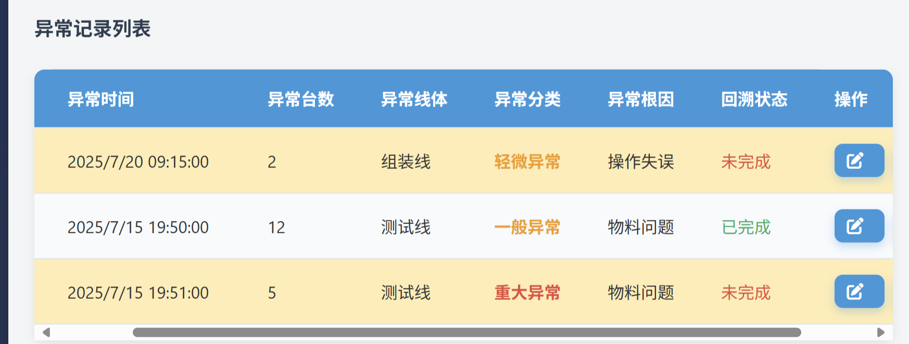

# 直通率异常分析与统计系统

一个用于追踪、分析生产异常的Web应用，提供数据录入、统计分析和可视化功能。

## 功能特性

- 📝 **异常信息录入**：完整记录产品异常详情
- 📊 **数据可视化**：图表展示异常趋势和根因分布
- 🔍 **智能筛选**：多条件过滤异常记录
- 🔔 **提醒系统**：未完成回溯异常提醒
- 📱 **响应式设计**：适配不同设备屏幕

## 截图预览

## 技术栈

- **前端**：HTML5, CSS3, JavaScript
- **图表库**：Chart.js
- **图标库**：Font Awesome 6
- **数据存储**：LocalStorage

## 安装使用

### 浏览器直接运行
1. 下载项目文件
2. 双击打开`直通率异常分析与统计系统.html`

